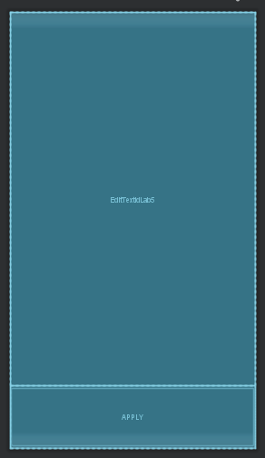

# Лабораторная работа №5. UI Tests.

## Цели
1. Ознакомиться с принципами и получить практические навыки разработки UI тестов для Android приложений.

## Задачи
Предполагается, что все задачи решаются с помощью Instrumentation (Android) tests и Espresso Framework, если иное явно не указано в тексте задания.

### Задача 1. Простейший UI тест
Ознакомьтесь с [Espresso Framework](https://developer.android.com/training/testing/espresso). Разработайте приложение, в котором есть одна кнопка **Button** и одно текстовое поле **EditText**. При (первом) нажатии на кнопку текст на кнопке должен меняться.

Напишите Espresso тест, который проверяет, что при повороте экрана содержимое текстового поля (каким бы оно ни было) сохраняется, а надпись на кнопке сбрасывается в исходное состояние. 

* Разработанный layout, совмещенный с проектом первых двух лабораторных работ, для работы с UI тестом



* Взаимодействие с кнопкой, происходит при помощи следующей функции и соединения **Button** с данной функцией внутри layout файла
```kotlin
    fun onClickLab5(view: View) {
        val btn = findViewById<Button>(R.id.ButtonIdLab5)
        btn.text = getString(R.string.Lab05PressedButtonMessage)
    }
```
```xml
    <Button
        android:id="@+id/ButtonIdLab5"
        android:onClick="onClickLab5"

        android:layout_width="match_parent"
        android:layout_height="0dp"
        android:layout_weight="1"

        android:text="@string/ButtonMessage" />
```

#### Указания
* Для поворота экрана можно воспользоваться 

```kotlin
        activityScenarioRule.scenario.onActivity { activity ->
            activity.setRequestedOrientation(
                ActivityInfo.SCREEN_ORIENTATION_LANDSCAPE
            )
        }
```
(см. также https://stackoverflow.com/a/42591933


Реализовали тест следующим образом, проходит, но добиться успеха по первичной документации сразу же не получилось, помогла [дополнительная документация](https://developer.android.com/training/testing/ui-testing/espresso-testing):
* в связи с спроектированным layout'ом, **Button** закрывалась клавиатурой, которая появляется после ввода текста в поле **EditText**, тем самым не давая теста кликнуть на то место, где находится кнопка
* потребовалось необходимое создание переменной **activityScenarioRule**, в которой запускается передаваемая активность перед началом тестов, и закрывается после
```kotlin
    @RunWith(AndroidJUnit4::class)
    class ExampleInstrumentedTest {
            @get:Rule
            val activityScenarioRule = ActivityScenarioRule(MainActivity::class.java)

            @Test
            fun checkEditTextSavesTextWhenRecreated() {
                onView(withId(R.id.EditTextIdLab5)).perform(typeText("lolita"), closeSoftKeyboard())
                onView(withId(R.id.ButtonIdLab5)).perform(click())

                onView(withId(R.id.EditTextIdLab5)).check(matches(withText("lolita")))
                onView(withId(R.id.ButtonIdLab5)).check(matches(withText("!*@\$?Y0U\'l23 H4CK3D^#!\$?(")))
                
                //Recreate realisation
                activityScenarioRule.scenario.onActivity { activity ->
                    activity.requestedOrientation = ActivityInfo.SCREEN_ORIENTATION_LANDSCAPE
                }

                //Checks that activity saved EditText.text, and destroy Button.text
                onView(withId(R.id.EditTextIdLab5)).check(matches(withText("lolita")))
                onView(withId(R.id.ButtonIdLab5)).check(matches(withText("Apply")))
            }
    }
```

* Если описанное поведение наблюдается, объясните, кто и в какой момент сохраняет состояние **EditText**. При необходимости освежите в памяти знания, усвоенные в Лаб. №2.

Стандартная реализация метода onSaveInstanceState() в работе Activity сохраняет временную информацию о состоянии иерархии **Activity's View**, какраз такую как в нашем случае (для **EditText**)

Более подробно [здесь](https://developer.android.com/guide/components/activities/activity-lifecycle) Ctrl+F -> EditText

### Задача 2. Тестирование навигации.
Возьмите приложение из Лаб №3 о навигации (любое из решений). Напишите UI тесты, проверяющие навигацию между 4мя исходными Activity/Fragment (1-2-3-About). В отчете опишите, что проверяет каждый тест.

#### Указания
1. Должно получиться несколько тестов. Если получается один огромный тест, который проверяет сразу все, - его нужно разделить на более мелкие тесты некоторым разумным образом.
1. Проверяйте глубину backstack (например, с помощью навигации "назад" из разных исходных состояний)
1. Проверяйте навигацию "вперед": кнопки должны открывать соответствующие Activity/Fragment
1. Проверяйте, что при повороте экрана состояние не теряется

## Вывод
По ходу работы достиг все цели и решил все задачи, выше описал выводы по своей работе, также кратко конспектирую:
* Научились работать с модулем Espresso, для тестирования взаимодействия UI и другими компонентами, которые тестируются прямо на физическом устройстве!
* Кратко повторили проектирование требуемых по заданию layout's

[Дополнительные вопросы возникшие в ходе выполнения работы и решенные мной]
* Были включены в соответствующие разделы заданий.
