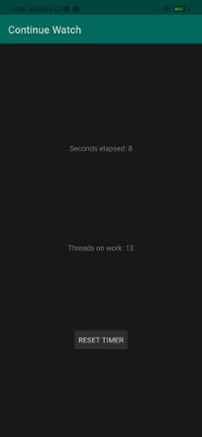
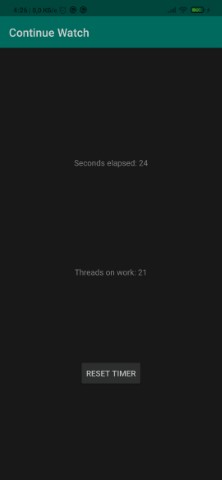
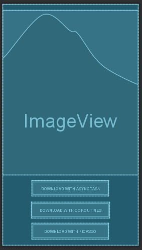
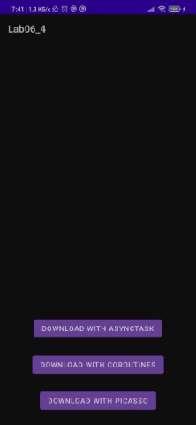
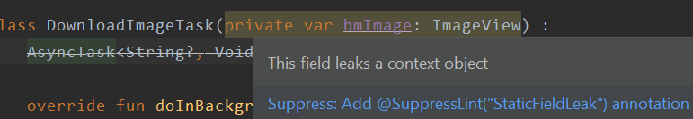
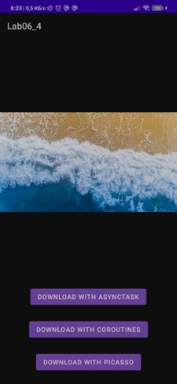
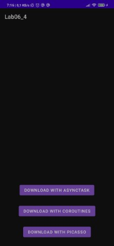
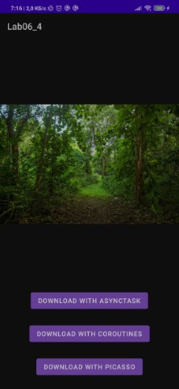

# Лабораторная работа №6. Многопоточные Android приложения.

## Цели
Получить практические навыки разработки многопоточных приложений:
1. Организация обработки длительных операций в background (worker) thread:
    * Запуск фоновой операции (coroutine/asynctask/thread)
    * Остановка фоновой операции (coroutine/asynctask/thread)
2. Публикация данных из background (worker) thread в main (ui) thread.

3. Освоить 3 основные группы API для разработки многопоточных приложений:
    * Kotlin Coroutines
    * AsyncTask
    * Java Threads

## Задачи
### Задача 1. Альтернативные решения задачи "не секундомер" из Лаб. 2
Используйте приложение "не секундомер", получившееся в результате выполнениня [Лабораторной работы №2](../Lab02/lab06.md). Разработайте несколько альтернативных приложений "не секундомер", отличающихся друг от друга организацией многопоточной работы. Опишите все известные Вам решения.

#### Указания
К моменту выполнения работы Вам должно быть известно, как минимум, 4 принципиально разных подхода к решению задачи. В отчете должны появиться, как минимум, 3 решения:
1. С помощью Java Threads (фактически, это оригинальный код, однако на этот раз необходимо убедиться, что потоки запускаются и останавливаются в определенные моменты времени. Опишите эти моменты времени в отчете. Обратите внимание, что потоки не должны существовать, когда приложение не отображается на экране).

Для того, чтобы пойти в правильном направлении в реализации через Java Threads, стоит посмотреть, как себя ведут потоки в начальном исполнении [continuewatch]() и подумать куда стоит двигаться, для этого, так же с выводом времени, будем выводить информацию о количестве потоков, так же данный вывод подскажет нам в дальнейшем, если мы пойдем по одной из задач в неправильном направлении

Добавим в работу потока следующую строку  

```kotlin
     threadsPool.text = getString(R.string.threads, Thread.getAllStackTraces().keys.size)
```

А теперь понаблюдаем за работой приложения на практике. 




В действительности, при многочисленном повороте экрана потоки плодятся, изначально их было 13, а в скоре уже стало 21, это не то, как следует реализовывать свои приложения, будем исправлять!


2. С помощью [AsyncTask](http://developer.android.com/reference/android/os/AsyncTask.html). Используйте метод **publishProgress()** (аналогичный пример можно найти по [ссылке](http://developer.alexanderklimov.ru/android/theory/asynctask.php))


3. С помощью [Kotlin Coroutines](https://developer.android.com/kotlin/coroutines). В качестве знакомства с корутинами рекомендуется выполнить шаги 1-6 (включительно) из codelab: https://codelabs.developers.google.com/codelabs/kotlin-coroutines

Также можно улучшить точность подсчета времени. `sleep(1000)` не гарантирует остановку потока *ровно* на 1000 мс. Подумайте, как избавиться от накапливающейся ошибки. Для улучшения мыслительного процесса поменяйте `sleep(1000)` на `sleep(367)`, или любое другое простое число.

### Задача 2. Загрузка картинки в фоновом потоке (AsyncTask) 
Создайте приложение, которое скачивает картинку из интернета и размещает ее в **ImageView** в **Activity**. За основу возьмите [код со StackOverflow](https://stackoverflow.com/a/9288544).

Для начала, стоит упомянуть то, что для того, чтобы ваше приложение имело возможность взаимодействовать с интернетом, в файле **AndroidManifest.xml** необходимо объявить следующее дополнение
```xml
   <uses-permission android:name="android.permission.INTERNET" />
```

Для этой и цикла следующих задач, будет разработан один layout, имеющий область **ImageView** и 3 области **Button**, по одной на каждое из заданий, попробуем реализовать все функции в одном файле Activity



Так как есть рекомендация по исполнению, воспользуемся ей, и конечно разберемся как она работает

Был взят и адаптирован код, реализован класс **DownloadImageTask**
```kotlin
   class DownloadImageTask(private var bmImage: ImageView) :
       AsyncTask<String?, Void?, Bitmap?>() {

       override fun doInBackground(vararg urls: String?): Bitmap? {
           val urlDisplay = urls[0]
           var bitmapImage: Bitmap? = null
           try {
               val stream: InputStream = URL(urlDisplay).openStream()
               bitmapImage = BitmapFactory.decodeStream(stream)
           } catch (e: Exception) {
               e.printStackTrace()
           }
           return bitmapImage
       }

       override fun onPostExecute(result: Bitmap?) {
           bmImage.setImageBitmap(result)
       }
   }
```

В Activity исполнен следующий метод и связан с соответствующей кнопкой в layout
```kotlin
    fun onClickAsyncTask(view: View) {
        val imageView = findViewById<ImageView>(R.id.ImageView)
        DownloadImageTask(imageView).execute(link.random())
    }
```




И все же, вновь говоря об этом методе реализации, стоит упомянуть, что сам класс **AsyncTask** был deprecated на 30 уровне API, по заявлению в документации к нему, говориться о том, что данный способ, может привести к утечке объекта Context, что можем заметить и в упоминании **Android Studio**



### Задача 3. Загрузка картинки в фоновом потоке (Kotlin Coroutines) 
Перепишите предыдущее приложение с использованием Kotlin Coroutines.

Повзаимодействуем с Kotlin Coroutines, воспользуемся функцией из предыдущей реализации, которая загружает изображение, но в этот раз не будет определять никаких дополнительных классов, а реализуем все в **MainActivity**
```kotlin
   fun onClickCoroutines(view: View) {
        val imageView = findViewById<ImageView>(R.id.ImageView)
        lifecycleScope.launchWhenResumed {
            var bitmapImage: Bitmap?

            withContext(Dispatchers.IO) {
                bitmapImage = download(link.random())
            }

            withContext(Dispatchers.Main) {
                imageView.setImageBitmap(bitmapImage)
            }
        }
    }

    private fun download(vararg urls: String?): Bitmap? {
        val urlDisplay = urls[0]
        var bitmapImage: Bitmap? = null
        try {
            val stream: InputStream = URL(urlDisplay).openStream()
            bitmapImage = BitmapFactory.decodeStream(stream)
        } catch (e: Exception) {
            e.printStackTrace()
        }
        return bitmapImage
    }
```
При нажатии на кнопку даем хода lifecycleScope при помощи launchWhenResumed, при помощи suspend-функций withContext запускаем корутины

А при помощи диспетчера определяем два потока, по логике:
* **IO (Ввода-вывода)** - загрузка строки, отработка функции и скачивание картинки
* **Main (UI)** - передача изображения во View




### Задача 4. Использование сторонних библиотек 
Многие "стандартные" задачи имеют "стандартные" решения. Задача скачивания изображения в фоне возникает настолько часто, что уже сравнительно давно решение этой задачи занимает всего лишь несколько строчек. Убедитесь в этом на примере одной (любой) библиотеки [Glide](https://github.com/bumptech/glide#how-do-i-use-glide), [picasso](https://square.github.io/picasso/) или [fresco](https://frescolib.org/docs/index.html).

Поверхностно сравнив все 3 библиотеки, более компактным показался **Picasso**, заявляется, что загрузка пройдет легко и даже в одну строку, будем проверять!

Прикрепляем зависимость
```gradle
implementation 'com.squareup.picasso:picasso:(insert latest version)'
```

Не считая поиска ImageView, куда будем отправлять картинку, функционал библиотеки действительно умещен в одну строку, хороший инструмент для загрузки картинок!
```kotlin
   fun onClickPicasso(view: View) {
        val imageView = findViewById<ImageView>(R.id.ImageView)
        Picasso.get().load(link.random()).into(imageView)
    }
```




## Вывод
По ходу работы достиг все цели и решил все задачи, выше описал выводы по своей работе, пройдемся кратко:
* В одной лабораторной работе, посмотрели много всего, а главное затронули работу трех инструментов управления многопоточного режима (coroutines/asynctasks/threads)
* Дали приложению доступ выхода в интернет, в поле которого, открывается множетсво возможностей для других взаимодействий между приложением и другими сервисами
* Загрузили картинки и поместили в блок ImageView, так же воспользовались специальной библиотекой, которая довольно емко решает задачу

[Дополнительные вопросы возникшие в ходе выполнения работы и решенные мной]
* Были включены в соответствующие разделы заданий.
* Как всегда, не стоит забывать о разного рода [документации](https://developer.android.com/guide/components/processes-and-threads), в которой более полно и емко можно найти описания подробности работы системы Андроид. Данная статья дает более полное представление о работе потоков и какой для чего поток стоит занимать, а какой явно трогать не стоит.
