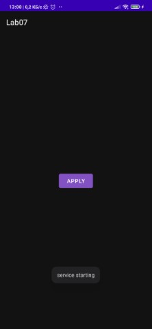
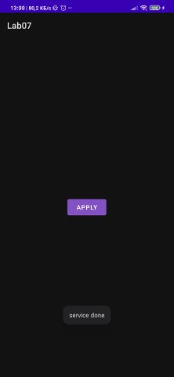
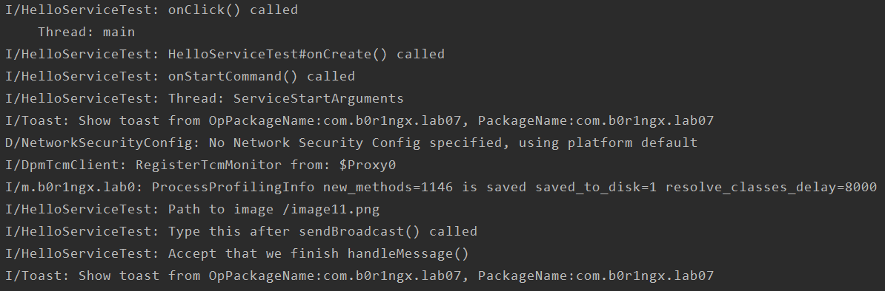
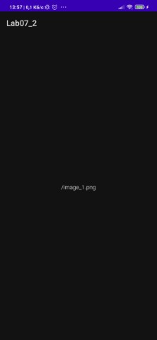

# Лабораторная работа №7. Сервисы и Broadcast Receivers.

## Цели
Получить практические навыки разработки сервисов (started и bound) и Broadcast Receivers.

## Задачи
### Задача 1. Started сервис для скачивания изображения
В [лабораторной работе №6](../Lab06/lab06.md) был разработан код, скачивающий картинку из интернета. На основе этого кода разработайте started service, скачивающий файл из интернета. URL изображения для скачивания должен передаваться в Intent. Убедитесь (и опишите доказательство в отчете), что код для скачивания исполняется не в UI потоке

Добавьте в разработанный сервис функцию отправки broadcast сообщения по завершении скачивания. Сообщение (Intent) должен содержать путь к скачанному файлу.

### Задача 2. Broadcast Receiver
Разработайте два приложения: первое приложение содержит 1 activity с 1 кнопкой, при нажатии на которую запускается сервис по скачиванию файла. Второе приложение содержит 1 broadcast receiver и 1 activity. Broadcast receiver по получении сообщения из сервиса инициирует отображение *пути* к изображению в `TextView` в Activity.

### Задача 3. Bound Service для скачивания изображения
Сделайте разработанный сервис одновременно bound И started: переопределите метод `onBind`. Из тела метода возвращайте `IBinder`, полученный из класса [`Messenger`](https://developer.android.com/guide/components/bound-services?hl=ru#Messenger). Убедитесь (доказательство опишите в отчете), что код скачивания файла исполняется не в UI потоке.

Измените способ запуска сервиса в первом приложении: вместо `startService` используйте `bindService`. При нажатии на кнопку отправляйте сообщение [`Message`](https://developer.android.com/reference/android/os/Message.html?hl=ru), используя класс `Messenger`, полученный из интерфейса `IBinder` в методе [`onServiceConnected`](https://developer.android.com/reference/android/content/ServiceConnection.html?hl=ru#onServiceConnected(android.content.ComponentName,%20android.os.IBinder)).

Добавьте в первое приложение `TextView`, а в сервис отправку [обратного](https://developer.android.com/reference/android/os/Message.html?hl=ru#replyTo) сообщения с местоположением скачанного файла. При получении сообщения от сервиса приложение должно отобразить путь к файлу на экране.

Обратите внимание, что разработанный сервис должен быть одновременно bound И started. Если получен интент через механизм started service, то сервис скачивает файл и отправляет broadcast (started service не знает своих клиентов и не предназначен для двухсторонней коммуникации). Если получен message через механизм bound service, то скачивается файл и результат отправляется тому клиенту, который запросил этот файл (т.к. bound service знает всех своих клиентов и может им отвечать).
